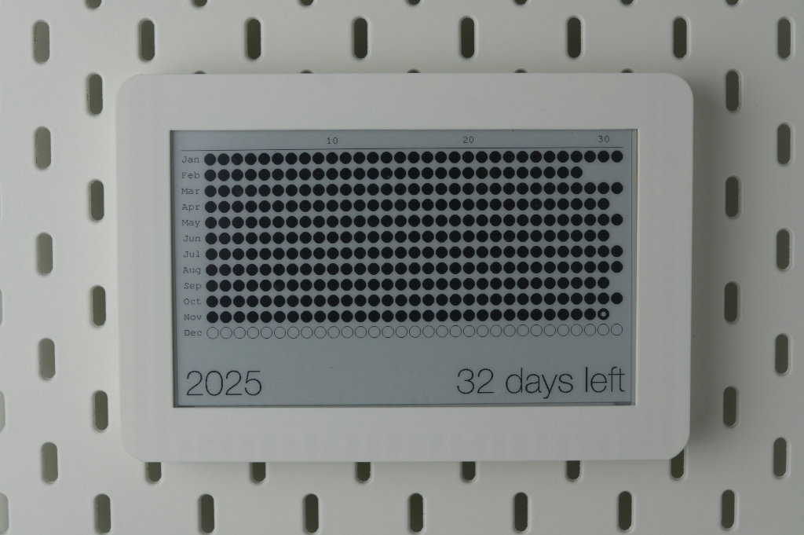
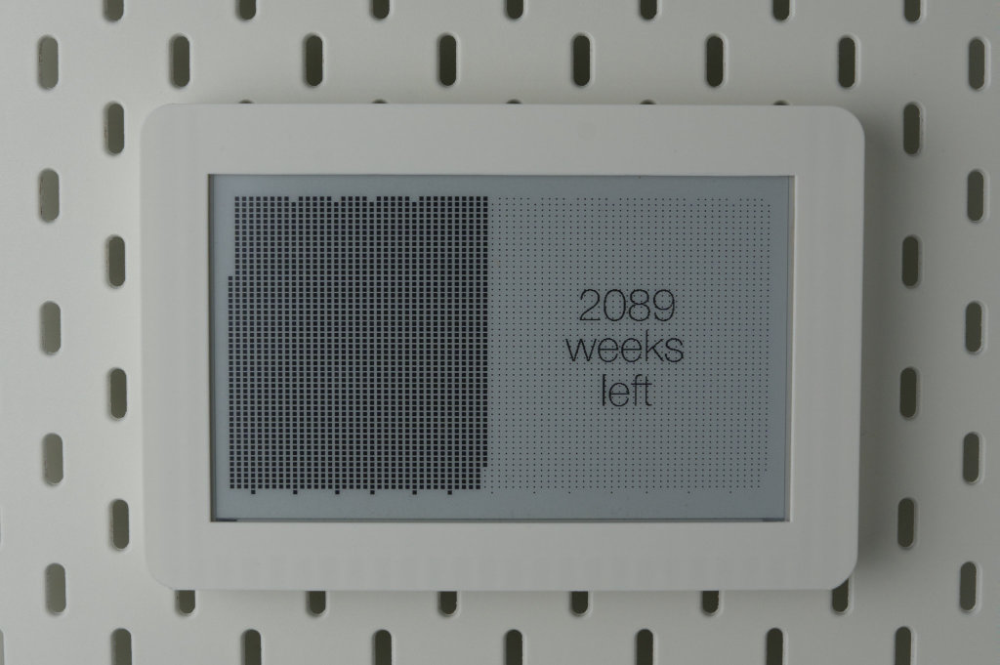

# Left

Left is a minimalist firmware for [ESP32 and Waveshare 7.5" e-ink displays](https://www.amazon.de/-/en/Display-Electronic-Raspberry-Interface-Bluetooth/dp/B07MB7SVHQ/). It serves as a dedicated, low-power dashboard to visualize the finite nature of time.

It features two modes:





## Getting up and running

- Assuming you've install Arduino IDE
- Assuming you've installed `esp32` (by Espressif Systems) board inside Arduino IDE > Boards Manager
    - At the time of writing this, its version is 3.1.3
- In Arduino IDE > Library Manager, search and install `GxEPD2` (by Jead-Marc Zingg).
    - At the time of writing this, it's version 1.6.2.
    - Don't forget to install its dependencies as well.
- Now, the libraries are set
- Double click `left.ino` and let the Arduino IDE opens it
- Create a `crendentials.h` file
```c
#ifndef CREDENTIALS_H
#define CREDENTIALS_H

// Wifi credentials to get date/time
const char *WIFI_SSID = "your_wifi_name";
const char *WIFI_PASSWORD = "your_wifi_password";

// Birth date (for life expectancy calculations)
const int BIRTH_YEAR = 1989;
const int BIRTH_MONTH = 4;   // April (1-based, will be converted to 0-based in code)
const int BIRTH_DAY = 12;

#endif 
```
- Click upload & see it's working

## Enclosure/Frame

I have designed a custom enclosure to mount this specific hardware setup onto an IKEA Skadis board. It hides the driver board and cables for a clean look.

Here is the makerworld link: https://makerworld.com/en/models/2077330-waveshare-7-5-e-ink-display-frame-for-ikea-skadis

Fusion 360 source file, and BambuLab print file can be found under `enclosure` folder.
